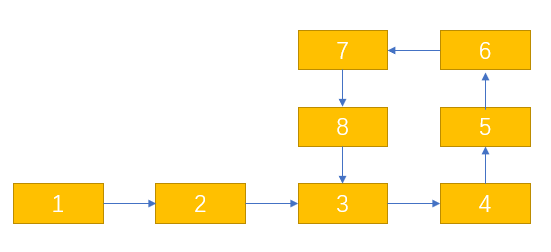

## 快慢指针 ##

## 链表翻转 ##

## 排序 ##

## 合并多个链表 ##

## 判断是否是环形链表 ##
  > 使用快慢指针， 当快慢指针相遇的时候 ， 则说明链表有环

## 判断环形指针的起始点 ##

假设在 7 这个地方相遇
(1-3) 长度 = a
(3-7) 长度 = b
(7-3) 长度 = c

慢指针在第一次相遇的时候的路程是 S = (a + b)
快指针在第一次相遇的时候路程是   2S = (a + b + c + b)

换算下来发现 是 S = b + c
又因为 S = a + b
所以 a = c

则第一次相遇的时候， 其中一个指针到起始位置， 已同样每次一步的速度， 再次相遇的时候就是开始起点

## 回文链表 ##

## 哑巴节点的使用 ##
> https://leetcode-cn.com/problems/partition-list/submissions/

https://greyireland.gitbook.io/algorithm-pattern/shu-ju-jie-gou-pian/linked_list